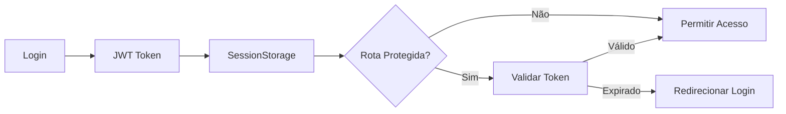

# Cloud Order - Frontend

[](https://nodejs.org/)
[](https://react.dev/)
[](https://tailwindcss.com/)
[](https://vitejs.dev/)
[](#licença)

> **Cloud Order** é uma plataforma de e-commerce moderna para gerenciamento eficiente de pedidos e produtos, com painel administrativo completo e interfaces responsivas otimizadas para todos os dispositivos.

## 📋 Índice

- [Visão Geral](#visão-geral)
- [Funcionalidades](#funcionalidades)
- [Stack Tecnológico](#stack-tecnológico)
- [Instalação](#instalação)
- [Configuração](#configuração)
- [Scripts Disponíveis](#scripts-disponíveis)
- [Arquitetura](#arquitetura)
- [Segurança](#segurança)
- [Variáveis de Ambiente](#variáveis-de-ambiente)
- [Deploy](#deploy)
- [Contribuição](#contribuição)
- [Padrões de Código](#padrões-de-código)
- [Troubleshooting](#troubleshooting)
- [Licença](#licença)

## 🎯 Visão Geral

Cloud Order é uma aplicação web desenvolvida com React e Tailwind CSS que oferece duas experiências distintas:

- **Interface Cliente**: Plataforma de compras com catálogo de produtos, carrinho interativo e gestão de pedidos
- **Painel Administrativo**: Dashboard completo com analytics, gerenciamento de produtos, pedidos e análise de estoque

A aplicação prioriza segurança, performance e experiência do usuário, com autenticação JWT, validação de dados rigorosa e design responsivo.

## ✨ Funcionalidades

### 👥 Cliente

| Funcionalidade               | Descrição                                                        |
| ---------------------------- | ---------------------------------------------------------------- |
| 🛒 **Catálogo de Produtos**  | Navegação intuitiva com filtros e busca                          |
| 📦 **Carrinho Dinâmico**     | Adicionar, remover e atualizar quantidade de itens em tempo real |
| 🛍️ **Checkout Simplificado** | Processo de compra otimizado com validação de dados              |
| 📋 **Histórico de Pedidos**  | Visualização detalhada de todos os pedidos realizados            |
| 📊 **Status de Pedidos**     | Acompanhamento em tempo real do progresso dos pedidos            |
| 🏠 **Perfil do Usuário**     | Gerenciamento de informações pessoais e endereços                |

### 🔧 Administrador

| Funcionalidade                  | Descrição                                                  |
| ------------------------------- | ---------------------------------------------------------- |
| 📈 **Dashboard Analítico**      | Estatísticas de vendas, receita e performance              |
| 🏷️ **Gestão de Produtos**       | CRUD completo com controle de estoque                      |
| 📦 **Gerenciamento de Pedidos** | Visualização, filtros avançados e atualização de status    |
| ⚠️ **Alertas de Estoque**       | Notificações automáticas de produtos com baixo estoque     |
| 👥 **Análise de Clientes**      | Métricas de clientes e padrões de compra                   |
| 🔔 **Notificações**             | Sistema de toast notifications para feedback em tempo real |

## 🛠️ Stack Tecnológico

### Core Framework

- **React 19** - Biblioteca UI moderna com hooks e componentes reutilizáveis
- **React Router DOM 7** - Roteamento SPA com navegação declarativa
- **Vite 5** - Build tool de próxima geração com HMR ultrarrápido

### State Management & Persistence

- **Zustand 5** - Gerenciamento de estado minimalista e eficiente
- **SessionStorage** - Persistência de autenticação por sessão

### Styling & UI

- **Tailwind CSS 4** - Framework CSS utilitário com design responsivo
- **PostCSS** - Pré-processador CSS
- **Lucide React** - Biblioteca de ícones SVG premium

### Validação & Dados

- **Zod** - Validação de schema TypeScript-first
- **Axios** - Cliente HTTP com interceptadores

### Desenvolvimento

- **ESLint** - Linting de código
- **Prettier** - Formatação automática
- **Vitest** - Framework de testes unitários e de integração

## 🚀 Instalação

### Pré-requisitos

- **Node.js** 20+ ([Download](https://nodejs.org/))
- **npm** 10+ ou **yarn** 4+
- **Git** para versionamento

### Passos de Instalação

1. **Clone o repositório**

```bash
git clone https://github.com/seu-usuario/cloud-order-front.git
cd cloud-order-front
```

2. **Instale as dependências**

```bash
npm install
# ou
yarn install
```

3. **Configure as variáveis de ambiente** (veja seção [Configuração](#configuração))

4. **Inicie o servidor de desenvolvimento**

```bash
npm run dev
```

O aplicativo estará acessível em [http://localhost:5173](http://localhost:5173)

## ⚙️ Configuração

### Desenvolvimento

1. **Copie o arquivo de exemplo**

```bash
cp .env.example .env.local
```

2. **Configure as variáveis**

```env
VITE_API_URL=http://localhost:3000
VITE_API_TIMEOUT=10000
```

### Produção

O arquivo `.env.production` vem pré-configurado com HTTPS obrigatória:

```env
VITE_API_URL=https://api.cloud-order.com
VITE_API_TIMEOUT=10000
```

> ⚠️ **Importante**: Nunca commite arquivos `.env` com dados sensíveis. Use processamento de variáveis do seu CI/CD.

## 📦 Scripts Disponíveis

| Script      | Comando           | Descrição                      |
| ----------- | ----------------- | ------------------------------ |
| **dev**     | `npm run dev`     | Inicia servidor com hot reload |
| **build**   | `npm run build`   | Compila para produção          |
| **preview** | `npm run preview` | Visualiza build localmente     |
| **lint**    | `npm run lint`    | Valida código com ESLint       |
| **format**  | `npm run format`  | Formata código com Prettier    |
| **test**    | `npm run test`    | Executa testes unitários       |

Exemplo de uso:

```bash
npm run dev       # Desenvolvimento
npm run build     # Produção
npm run preview   # Prévia da build
```

## 📐 Arquitetura

### Estrutura de Diretórios

```
src/
├── components/          # Componentes reutilizáveis
│   ├── AdminNavbar.jsx
│   ├── Navbar.jsx
│   ├── RequireAdminAuth.jsx
│   └── RequireCustomerAuth.jsx
├── pages/              # Páginas principais
│   ├── admin/         # Painel administrativo
│   ├── auth/          # Autenticação
│   ├── checkout/      # Processo de compra
│   ├── home/          # Página inicial
│   └── orders/        # Histórico de pedidos
├── hooks/             # Custom React hooks
├── store/             # Zustand stores (estado global)
├── service/           # Serviços API
├── utils/             # Funções utilitárias
└── App.jsx            # Root component
```

### Pattern de Componentes

```jsx
// Componente funcional com destructuring
export default function MyComponent({ prop1, prop2 }) {
  return <div className="responsive-classes">{/* conteúdo */}</div>;
}
```

### State Management (Zustand)

```jsx
// store/myStore.js
import { create } from 'zustand';

export const useMyStore = create((set) => ({
  data: [],
  setData: (data) => set({ data }),
}));
```

## 🔐 Segurança

### Práticas Implementadas

- ✅ **Autenticação JWT**: Bearer tokens em SessionStorage (não em LocalStorage)
- ✅ **HTTPS Obrigatória**: Apenas HTTPS em produção
- ✅ **Validação de Entrada**: Zod schema para toda entrada de dados
- ✅ **Proteção de Rotas**: Guards com `RequireAdminAuth` e `RequireCustomerAuth`
- ✅ **Tokens Seguros**: SessionStorage garante tokens apenas durante a sessão
- ✅ **CORS Configurado**: Apenas domínios autorizados na API
- ✅ **Content Security Policy**: Headers de segurança na produção

### Fluxo de Autenticação



## 🌍 Variáveis de Ambiente

### Desenvolvimento

| Variável           | Valor Padrão            | Descrição                   |
| ------------------ | ----------------------- | --------------------------- |
| `VITE_API_URL`     | `http://localhost:3000` | URL da API backend          |
| `VITE_API_TIMEOUT` | `10000`                 | Timeout de requisições (ms) |

### Produção

| Variável           | Valor Padrão                  | Descrição                   |
| ------------------ | ----------------------------- | --------------------------- |
| `VITE_API_URL`     | `https://api.cloud-order.com` | URL segura da API           |
| `VITE_API_TIMEOUT` | `10000`                       | Timeout de requisições (ms) |

## 🚀 Deploy

### Vercel (Recomendado)

1. **Conecte seu repositório GitHub**

```bash
git push origin main
```

2. **Configure variáveis de ambiente no Vercel Dashboard**

3. **Deploy automático** em cada push para `main`

### Netlify

1. **Conecte seu repositório**

2. **Configure comando de build**: `npm run build`

3. **Configure diretório de distribuição**: `dist`

### Docker

```dockerfile
# Dockerfile
FROM node:20-alpine AS builder
WORKDIR /app
COPY package*.json ./
RUN npm ci
COPY . .
RUN npm run build

FROM node:20-alpine
WORKDIR /app
COPY --from=builder /app/dist ./dist
RUN npm install -g serve
EXPOSE 3000
CMD ["serve", "-s", "dist", "-l", "3000"]
```

Construir e executar:

```bash
docker build -t cloud-order-front .
docker run -p 3000:3000 cloud-order-front
```

## 🤝 Contribuição

### Como Contribuir

1. **Faça um Fork** do projeto
2. **Crie uma branch** para sua feature (`git checkout -b feature/MinhaFeature`)
3. **Commit suas mudanças** seguindo padrões (veja abaixo)
4. **Push para a branch** (`git push origin feature/MinhaFeature`)
5. **Abra um Pull Request** com descrição detalhada

### Reportar Bugs

Abra uma issue com:

- Descrição clara do problema
- Passos para reproduzir
- Comportamento esperado vs atual
- Screenshots (se aplicável)

## 📝 Padrões de Código

### Commits

Siga o [Conventional Commits](https://www.conventionalcommits.org/):

```
<tipo>[escopo opcional]: <descrição>

[corpo opcional]

[rodapé(s) opcional(is)]
```

**Tipos permitidos:**

- `feat:` Nova funcionalidade
- `fix:` Correção de bug
- `docs:` Documentação
- `style:` Formatação (sem mudança lógica)
- `refactor:` Refatoração de código
- `perf:` Melhoria de performance
- `test:` Testes
- `chore:` Tarefas de build/dependências
- `security:` Melhoria de segurança

**Exemplos:**

```bash
git commit -m "feat: adicionar filtro de data no dashboard"
git commit -m "fix: corrigir cálculo de total no carrinho"
git commit -m "docs: atualizar README com instruções de deploy"
```

### Naming Conventions

- **Componentes**: PascalCase (`MyComponent.jsx`)
- **Arquivos**: kebab-case ou PascalCase conforme tipo
- **Variáveis/Funções**: camelCase (`myVariable`, `myFunction`)
- **Constantes**: UPPER_SNAKE_CASE (`API_TIMEOUT`)

### Estilo de Código

- Máximo 100 caracteres por linha
- 2 espaços de indentação
- Semicolons obrigatórios
- Aspas simples em strings
- Use `const` por padrão

## 🔧 Troubleshooting

### Problema: Porta 5173 em uso

```bash
# Solução: Use outra porta
npm run dev -- --port 3001
```

### Problema: Erro de CORS

**Verifique:**

1. URL da API em `.env.local` está correta
2. Backend permite CORS para seu domínio
3. Verifique headers de CORS no backend

### Problema: Token expirado após refresh

**Solução:**

- Tokens em SessionStorage expiram ao fechar aba/browser
- Para persistência, configure backend para refresh tokens

### Problema: Build production não funciona

```bash
# Limpe cache e reinstale
rm -rf node_modules dist
npm install
npm run build
```

## 📄 Licença

Este projeto está licenciado sob a Licença MIT - veja o arquivo [LICENSE](LICENSE) para detalhes.

---

## 📞 Suporte

- **Issues**: [GitHub Issues](https://github.com/seu-usuario/cloud-order-front/issues)
- **Discussões**: [GitHub Discussions](https://github.com/seu-usuario/cloud-order-front/discussions)
- **Email**: support@cloud-order.com

---

<div align="center">

**Cloud Order - Gestão de Pedidos Simplificada**

Desenvolvido com ❤️ usando React, Tailwind CSS e Vite

[Voltar ao Topo](#cloud-order---frontend)

</div>
